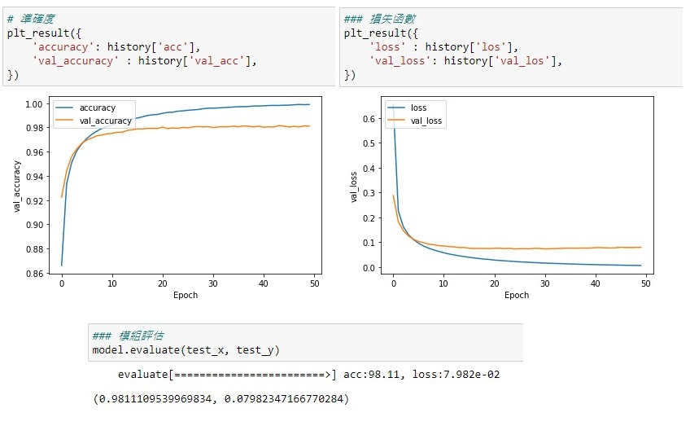
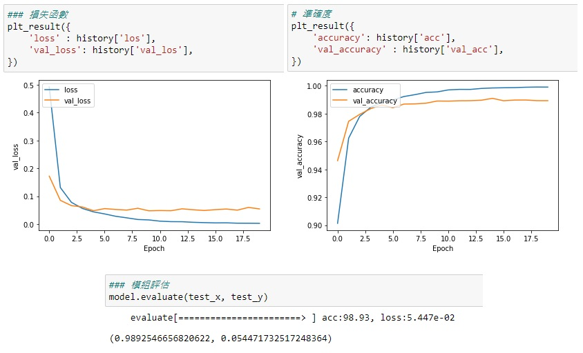

# python-dl-lib-MNIST
透過自製的學習框架嘗試學習

## 資料讀取
[Mnist.py](./Mnist.py) 將官方檔案解析成NumPy

詳細讀取資訊 [點這裡](http://yann.lecun.com/exdb/mnist/)

## 使用方式
\> `git clone git@github.com:fizz0113/python-dl-lib-MNIST.git`

\> `git submodule init`

\> `git submodule update`

## NN
基本的NN我疊代了50次，批量為256，效果不錯。
* 圖像拉直
* 隱藏層 128
* * 過BN
* * 過ReLU
* 輸出層 10
* * 過Softmax
* 損失函數使用CategoricalCrossEntropy
* 優化器使用Adam
```py
layers = (
    Flatten(),
    Dense(128),
    BatchNorm(),
    ReLU(),
    Dropout(0.25),
    Dense(10),
    Softmax(),
)
model = Model(layers=layers)
loss = CategoricalCrossEntropy()
optimizer=Adam(learning_rate=0.0005)
model.compile(optimizer=optimizer, lossfunc=loss)
```

## CNN
基本的CNN依原本NN再加上捲積層，疊代20次，批量512，提升效果欠佳。

> 也有嘗試過其他大小的Kernel但效果接近，以下數值以`0.983`為基準值。
>> 1. 嘗試批量256，準確度 +0.003 ~ -0.003
>>
>> 2. 嘗試捲積層改為 8x(5x5)，準確度 +0.005 ~ -0.002
>>
>> 3. 嘗試捲積層改為 8x(7x7)，準確度 +0.003 ~ -0.002
>>
>> 4. 嘗試捲基層改為 8x(5x5x)->8x(7x7)，準確度 +0.005~-0.003

* 捲基層 8*(3*3)
* * 過ReLU
* 捲基層 8*(3*3)
* * 過ReLU
* 最大池化層 (2*2)
* 圖像拉直
* 隱藏層 128
* * 過BN
* * 過ReLU
* 輸出層 10
* * 過Softmax
* 損失函數使用CategoricalCrossEntropy
* 優化器使用Adam
```py
layers = (
    Conv(k_no=8, k_size=3, is_add_padding=True),
    ReLU(),
    Conv(k_no=8, k_size=3, is_add_padding=True),
    ReLU(),
    MaxPooling(2),
    Dropout(0.05),
    Flatten(),
    Dense(128),
    BatchNorm(),
    ReLU(),
    Dropout(0.5),
    Dense(10),
    Softmax(),
)
model = Model(layers=layers)
loss = CategoricalCrossEntropy()
optimizer=Adam(learning_rate=0.005)
model.compile(optimizer=optimizer, lossfunc=loss)
```

## 關於準確度
我自己按照公式寫出來之後發現沒辦法跑到像Tensorflow那樣高，有稍微查了一下Tensorflow過每一層時都對數值進行校正，還有數值初始化的精度是64位元。

## 展示
### NN

### CNN
